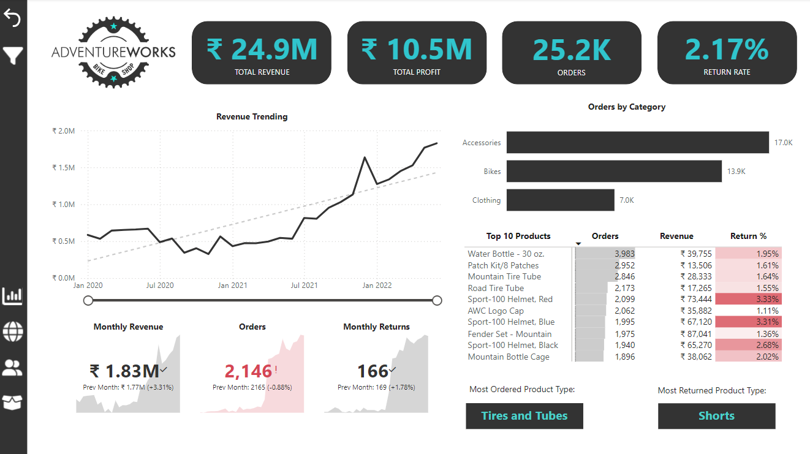
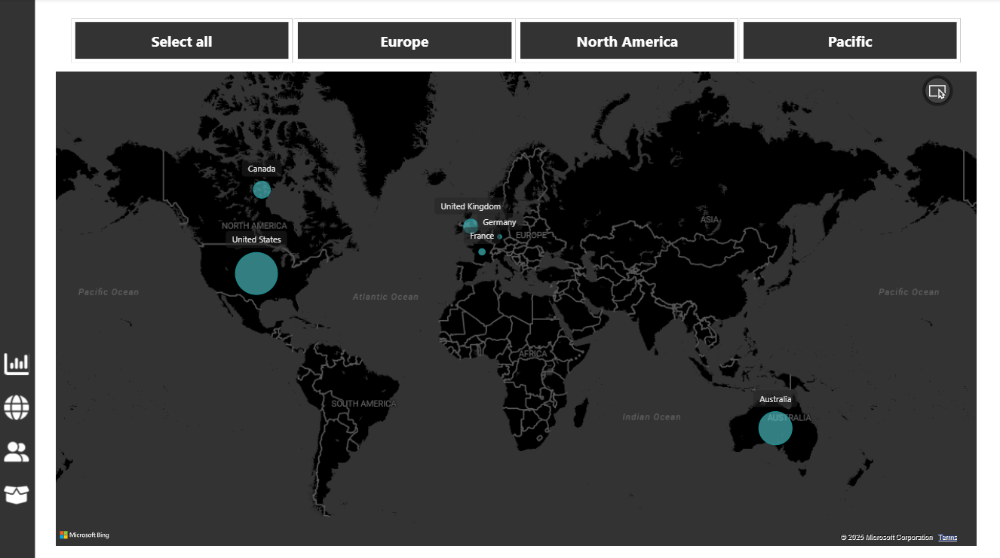
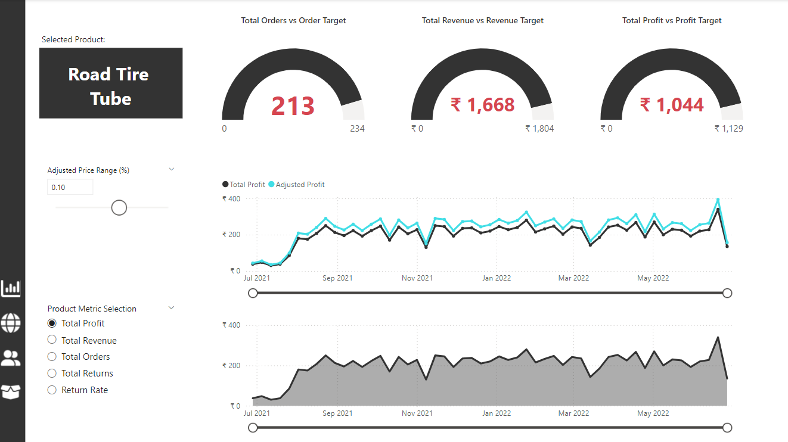
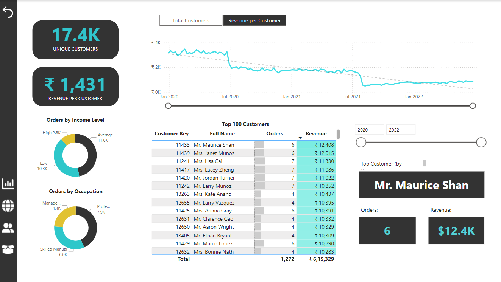

# 🚀 Power BI Dashboard Project: AdventureWorks Cycles  

## 📌 Overview  
This project demonstrates the end-to-end **Business Intelligence (BI) workflow** for **AdventureWorks Cycles**, a fictional 🚲 manufacturing company. The goal is to transform raw data into **professional-quality reports and dashboards** to track KPIs, compare regional performance, analyze product-level trends, and identify high-value customers.  

The project follows a structured approach, covering:  
✅ **Data Preparation**  
✅ **Data Modeling**  
✅ **Exploratory Data Analysis (EDA)**  
✅ **Data Visualization & Dashboard Design**  

---

## 🌟 Key Features  
- **📊 Stage 1: Connecting & Shaping Data**  
  🔹 Extract, clean, and transform data using **Power Query**.  
  🔹 Work with various **data connectors, storage modes**, and transformation tools.  
  🔹 Handle table transformations like **pivoting, unpivoting, grouping, merging, and appending**.  

- **🛠️ Stage 2: Creating a Relational Data Model**  
  🔹 Design a **star schema** for relational data modeling.  
  🔹 Establish **relationships**, set **cardinality**, and define **filter flows**.  
  🔹 Implement **database normalization** for efficient data storage.  

- **📐 Stage 3: Adding Calculated Fields with DAX**  
  🔹 Use **DAX (Data Analysis Expressions)** to create **calculated columns and measures**.  
  🔹 Implement **row & filter context**, **time intelligence patterns**, and advanced calculations.  
  🔹 Apply powerful DAX functions like **CALCULATE, FILTER, RELATED, and iterators**.  

- **📈 Stage 4: Visualizing Data with Reports**  
  🔹 Build **interactive dashboards** and reports with Power BI visuals.  
  🔹 Incorporate **slicers, bookmarks, tooltips, and custom visuals**.  
  🔹 Optimize **visualizations** with best practices for dashboard design and performance.  

---

## ❓ Key Questions Addressed  
🔹 **What are the key performance indicators (KPIs) for AdventureWorks Cycles?**  
🔹 **Which regions are performing best in terms of sales and profitability?**  
🔹 **What are the trends and patterns at the product level?**  
🔹 **Who are the high-value customers, and how can they be targeted effectively?**  
🔹 **How can data-driven insights improve decision-making for business growth?**  

---

## 🔍 Key Insights  
📌 **Sales Trends**: Identified **top-performing products** and seasonal patterns affecting sales.  
📌 **Regional Performance**: Highlighted **underperforming regions** requiring strategic focus.  
📌 **Customer Segmentation**: Revealed **high-value customer segments** for personalized marketing.  
📌 **Operational KPIs**: Monitored **production, inventory, and sales metrics** to improve operational efficiency.  

---

## 🛠️ Tools and Techniques Used  
1. 🏗️ **Power Query**: For **data extraction, transformation, and loading (ETL)**.  
2. 🏛️ **Power BI Data Modeling**: **Relational schema, star modeling, and relationship management**.  
3. 📊 **DAX (Data Analysis Expressions)**: **Advanced calculations and measures**.  
4. 🎨 **Power BI Visuals**: **Interactive dashboards, charts, slicers, and filters**.  

---

## 🖼️ Dashboard Screenshots  

### 📌 Executive Dashboard View  
  

### 🌍 Regional Dashboard View  
  

### 📦 Product Dashboard View  
  

### 🏆 Customer Dashboard View  
  

---

## 📖 How to Use  

1️⃣ **Clone the Repository**:  
   ```bash
   git clone https://github.com/username/adventureworks-powerbi-dashboard.git
